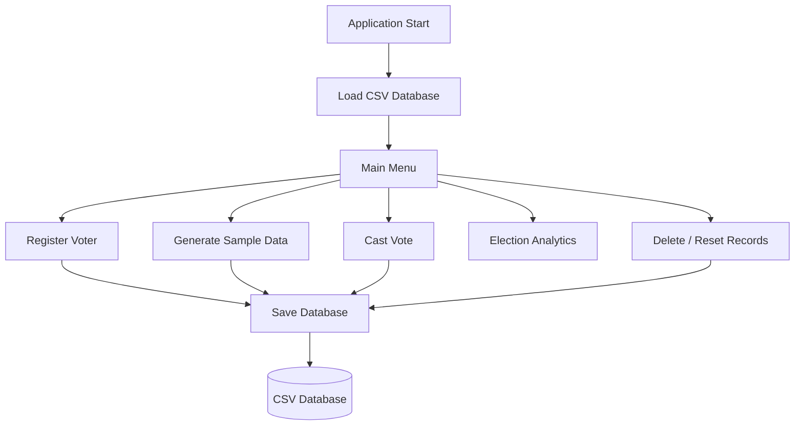
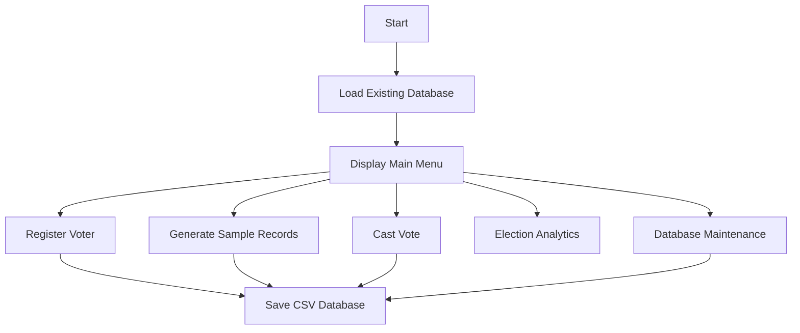

<div align="center">

# Karnataka State Voter Management System (VMS)

Console-Based Voter Management System developed in C for the Karnataka State Election Commission Case Study.

<p align="center">


</p>

</div>


## Overview

The Karnataka State Voter Management System (VMS) is a console-based application developed in C that simulates the voter registration and election management process of the Karnataka State Election Commission.

The application demonstrates structured programming, file handling, data validation, and election analytics using persistent CSV storage. It provides a practical implementation of voter registration, age verification, duplicate vote prevention, and election statistics generation.


## Features

- Voter Registration
- Automatic Age Verification
- Unique Voter ID Generation
- CSV-based Persistent Storage
- Bulk Sample Data Generation
- Election Analytics
- Polling Station Mode
- Duplicate Vote Prevention
- Record Deletion
- Database Reset


## Technology Stack

| Technology | Purpose |
|------------|---------|
| C (C99/C11) | Core Programming Language |
| GCC | Compiler |
| CSV Files | Persistent Data Storage |
| CLI | User Interface |
| Standard C Library | File & String Processing |


## Architecture




## Project Structure

```text
VMS/

├── vms.c
├── sec_database.csv
├── README.md
└── vms.exe
```


## Installation

### Clone Repository

```bash
git clone https://github.com/yourusername/Karnataka-State-Voter-Management-System.git

cd Karnataka-State-Voter-Management-System
```


### Requirements

- GCC Compiler
- C99/C11 Support
- Windows, Linux, or macOS


### Compile

#### Windows

```bash
gcc vms.c -o vms.exe

vms.exe
```

#### Linux / macOS

```bash
gcc vms.c -o vms

./vms
```


## System Workflow




## Core Modules

| Module | Description |
|----------|-------------|
| Voter Registration | Register eligible voters |
| Age Verification | Automatic DOB validation |
| Voter ID Generator | Generates unique voter IDs |
| Polling Station | Records votes |
| Analytics Engine | Election statistics |
| Sample Data Generator | Creates dummy voter records |
| Database Management | Delete and Reset records |


## Technical Specifications

| Property | Value |
|----------|-------|
| Language | C |
| Standard | C99 / C11 |
| Storage | CSV File |
| Interface | Command Line |
| Search Complexity | O(N) |
| Analytics Complexity | O(N) |
| Insertion Complexity | O(1) |


## Analytics

The system generates reports including:

- Voter Turnout Percentage
- Gender Distribution
- Youth, Adult, and Senior Population
- Voting Statistics
- Registered Voter Count


## Learning Outcomes

This project demonstrates practical implementation of:

- Structured Programming
- Modular Programming
- File Handling
- CSV Data Processing
- Input Validation
- String Manipulation
- Election Data Analytics
- Command-Line Application Development


## Future Enhancements

- Binary File Storage
- SQL Database Integration
- Optimized Search Algorithms
- Role-Based Authentication
- Graphical User Interface
- Cloud Database Support
- Digital Voter Verification
- Online Voting Simulation


## Academic Information

| Property | Value |
|----------|-------|
| Course | MCA – 1st Semester |
| Institution | VTU CPGS, Mysuru |
| Case Study | C Programming Case Study |
| Organization | Karnataka State Election Commission |
| Version | 1.0 |
| Author | Shyam Pillai |


## Disclaimer

This application is an academic case study developed for educational purposes only.

It is **not** affiliated with or endorsed by the Karnataka State Election Commission and should not be considered an official election management system.


## License

This project is licensed under the MIT License.


## Contact

<p align="left">
  <a href="mailto:shyam.m.pillai71@gmail.com">
    
  </a>

  <a href="https://linkedin.com/in/shyampillai07">
    
  </a>
</p>

For questions, feedback, or collaboration opportunities, feel free to reach out.
